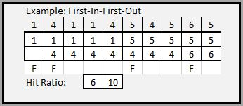

# Teach 10 : Page Replacement

##### Please work together in groups of 2 or 3

## Problems

In section 8.4 Page Replacement, there are a few page replacement algorithms mentioned. These are graphically illustrated in Figure 8.12, 8.14, and 8.15. Your job is to solve a few page replacement problems for three algorithms: First-In-First-Out, LRU, and Second-Chance.

Start by opening:

[345.10.Teach-Problems.xlsx](teach-problems.xlsx)

In this spreadsheet, you will find one example (First-In-First-Out with only 2 frames) and six unfinished problems. For each of these problems, 1) fill in the page frames from the given reference string, 2) make note of the page faults, and 3) compute the hit ratio.

### 1\. Page frames

Each column corresponds to the state of memory after a given page request is made. For example in the first column of the example, page '1' is requested. We can see that the first slot in the page frame is then allocated to page 1. In the second column, page '4' is requested. Again, we can see that the empty second slot is filled with page '4'. As time progresses from left to right, we can see how the various page requests (in the column header above the thick black line) result in page frames changing.

The column header is called the "reference string." This refers to the sequence of page requests that are made during the execution of the program.

### 2\. Page faults

Frequently a page is requested from the program but that page does not exist in the page frame. This triggers a "page fault." Recall from the reading that a page fault is a signal to the memory manager that a page existing on the disk needs to be brought into main memory. As this process is expensive, the operating-system tries to do this as infrequently as possible. Whenever a page fault occurs in a given page frame, indicate that with an 'F' in the row below the page frame. For our example, we can see that a page fault occurred four times: on the 1st, 2nd, 6th and 9th memory request.

### 3\. Hit ratio

The final thing to be determined is the hit ratio. This is how often a page is requested when it already exists in memory. The hit ratio is the number of page hits over the number of page requests. In the example, 10 page requests were made. Of those, 4 were page faults and 6 were hits. This means the hit ratio is 6:10\. We express this by putting 6 in one box and 10 in the other.
