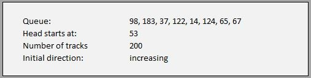

# Teach 11 : Disk Access Problem Set

##### Please work together in groups of 2 or 3

Please download the Microsoft Excel spreadsheet containing the two problems. The file is:

[Teach-Problems.xlsx](teach-problems.xlsx)

In this file, you will notice three tabs called "Example," "Problem Set 1," and "Problem Set 2." You will need to complete both of these problem sets.

Each problem set has seven parts: a) the details about the disk scheduling problem b) six algorithms to be carried out.

### A. Problem Details

The first table at the top of each sheet describes the problem details associated with each problem set. The following is an example:

The first item is the queue. This represents the sequence of track requests to the disk.

The second item is the location of the head at the start of the simulation. In this case, the head starts on top of track 53.

Next is the number of tracks on the platter. In this case, there are 200 tracks so the valid track numbers are 0 through 199.

The final item is the initial direction of the arm. Here it is increasing, meaning it is going from a low track number to a higher number.

### B. Six Algorithms

There are six disk scheduling algorithms presented in the text. We are to implement each one.

#### Example

Consider the First-Come-First-Serve disk scheduling algorithm:

The "Start" column refers to the track location before the move and the "Finish" column refers to the track location after the move. Therefore the first column involved moving from track 53 to track 98.

The "Distance" column refers to how far the arm traveled during this move. Notice how the first movement of the arm was a distance of 45 tracks (98 - 53 = 45).

On the bottom of each table is an "Average" value. This is the average seek time for all the track requests in the simulation. In this case, the average distance traveled per request is 80 tracks.

### Instructions

You are to complete all six tables on both tabs (for a total of 12 tables). There will be two problem details (one for each tab) and six algorithms per tab.

Note that the "Start" column is computed for you. The first row comes from the "Head starts at" value and each subsequent row comes from the previous row's "Finish."

The "Average" value is also computed for you. This is done by averaging all the values in the "Distance" column.

